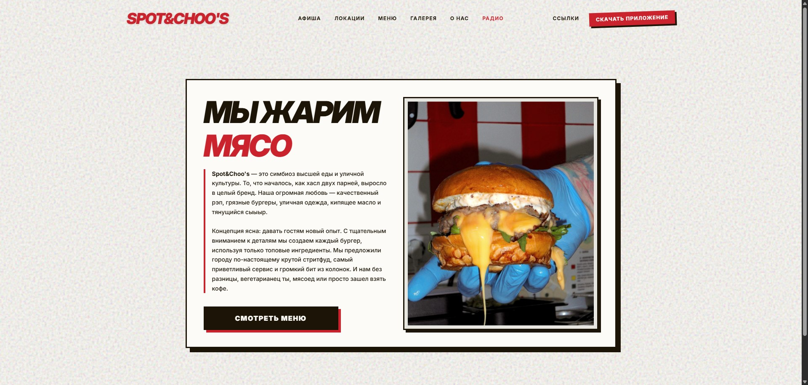
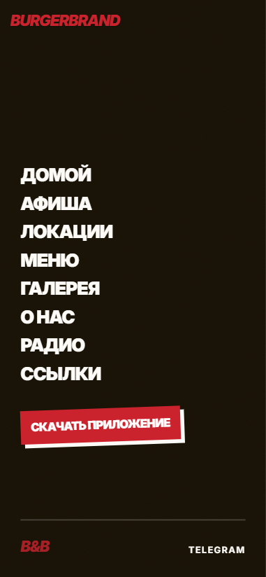
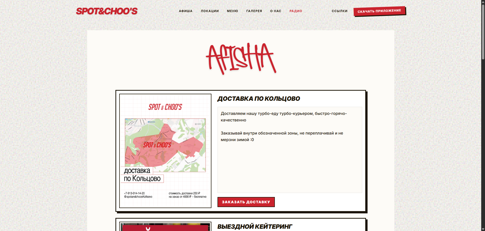
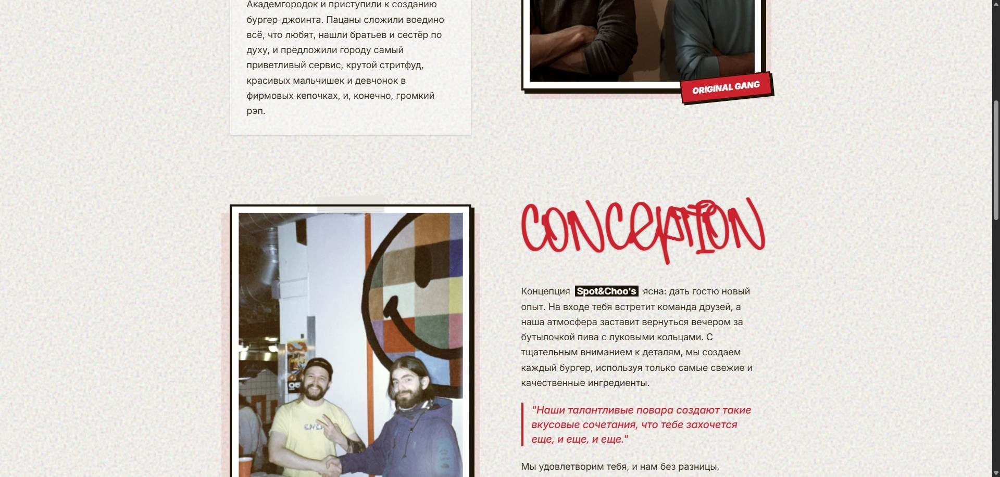

# Spot&Choo's (Concept Template)

A website template concept developed specifically for the Spot&Choo's burger restaurant and street food brand.
Концептуальный шаблон сайта, разработанный специально для бургерной и стритфуд-бренда Spot&Choo's.

---

## О проекте (RU)

Этот проект — frontend-концепт для сайта сети быстрого питания Spot&Choo's.  
Шаблон идеально подходит для демонстрации меню, анонса событий и предоставления информации о локациях заведения.

### Что есть в проекте

- главная секция
- афиша / блок с событиями
- меню
- блок с локациями (включая галереи)
- раздел «О нас»
- плеер фирменного онлайн-радио
- адаптация под мобильные устройства и десктоп
- анимации при скролле

### Стек

- React
- Vite
- Tailwind CSS
- JavaScript
- GSAP

---

## About the Project (ENG)

This project is a frontend concept template tailored for the Spot&Choo's fast food and street food brand.  
It is designed to showcase the menu, announce events, and provide detailed information about the restaurant's locations.

### Included sections

- main landing section
- events (Afisha) section
- menu section
- locations section (including photo galleries)
- about section
- custom branded online radio player
- responsive layout for mobile and desktop
- scroll-based animations

### Stack

- React
- Vite
- Tailwind CSS
- JavaScript
- GSAP

---

## Скриншоты / Screenshots

### Main Page

### Menu Section

### Events Section

### About Section

